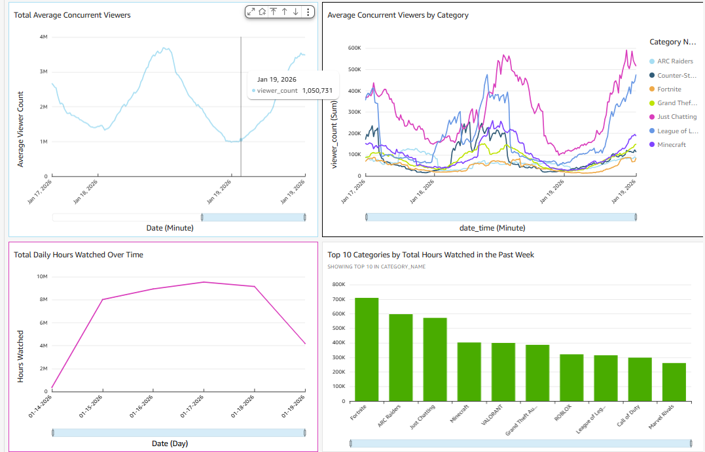
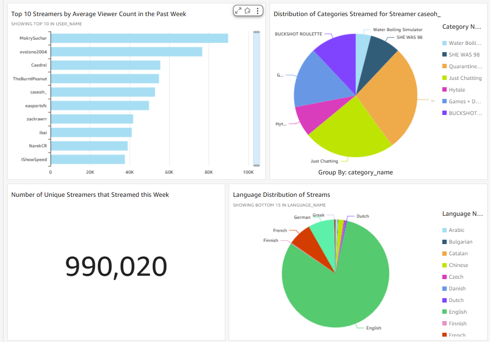

# Twitch Stream Data Pipeline on AWS

## Overview
This project is an end-to-end data pipeline hosted on AWS that ingests, processes, and stores data from the Twitch and IGDB APIs. The goal is to store and view historical stream data through multiple contexts such as time, broadcaster, category, genre, and game mode. The pipeline runs and collects data every 15 minutes and adopts an architecture similar to the medallion architecture where data is stored in a raw, processed, and curated layer. As of January 19, over 40,000,000 stream data points have been collected. AWS services such as Lambda, Simple Notification Service, Simple Queue Service, PostgreSQL, S3, Quicksight, and VPC are used in this project.

### Quicksight Dashboard Data Visualization

### Data Pipeline Architecture

### Database Data Model

## Lessons Learned
Developing an end-to-end data pipeline required a lot of work, time, and consideration for every component, tool, and program made. Not only did I spend a lot of time writing code to do simple data ingestion and processing, but I also had consider the proper project architecture, research and familiarize myself on proper AWS services and tools, recreate multiple iterations of the data model, and update components that failed over time.

The importance of data architecture became very apparent to me over time as I worked on my project. In the beginning, I simply had one S3 bucket that would store ingested API data that would eventually be processed then exported to my Postgres database. However, as I encountered errors in function code in ingesting, processing, and storing data, I realized I needed to make my programs more modular and to store data in different zones. Modularizing my code and having three layers to store raw, processed, and curated data made it easier to debug my pipeline and to identify what components of the pipeline were failing and why. Also, if there ever was an error in processing or curating data, I would still have access to raw data in the raw layer that I can eventually process, reducing data inconsistency.

I also had to dedicate a significant amount of time researching AWS tools and services. My data pipeline required a lot of components and steps to get data from the APIs to eventually flow to the database where it would be connected to a dashboard for visualizations. For example, if I wanted to process incoming raw data in a S3 bucket, I had to create a S3 trigger or a SNS topic that would trigger a Lambda function to process that data. I also wanted to run multiple Lambda functions that called the Twitch API concurrently. Familiarizing myself with how SQS and Lambda interacted was essential to accomplishing this. Learning how all these AWS services worked and connected was vital for my pipeline to actually work.

## Contact
Please feel free to contact me via Linkedin or email  

Linkedin: https://www.linkedin.com/in/emersonjin/  

Email: emersonjin01@gmail.com  

